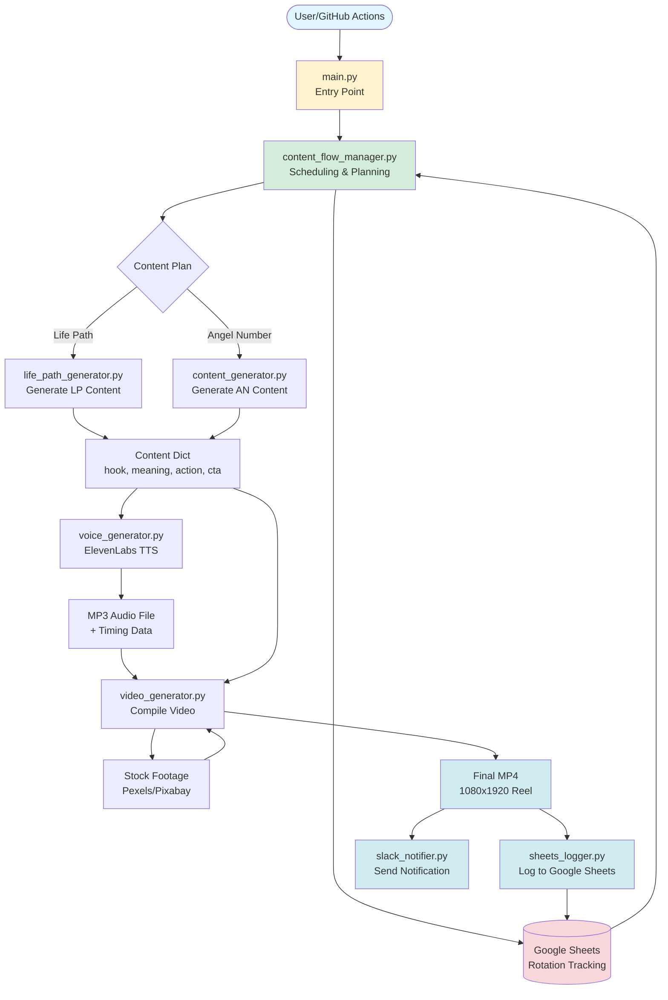
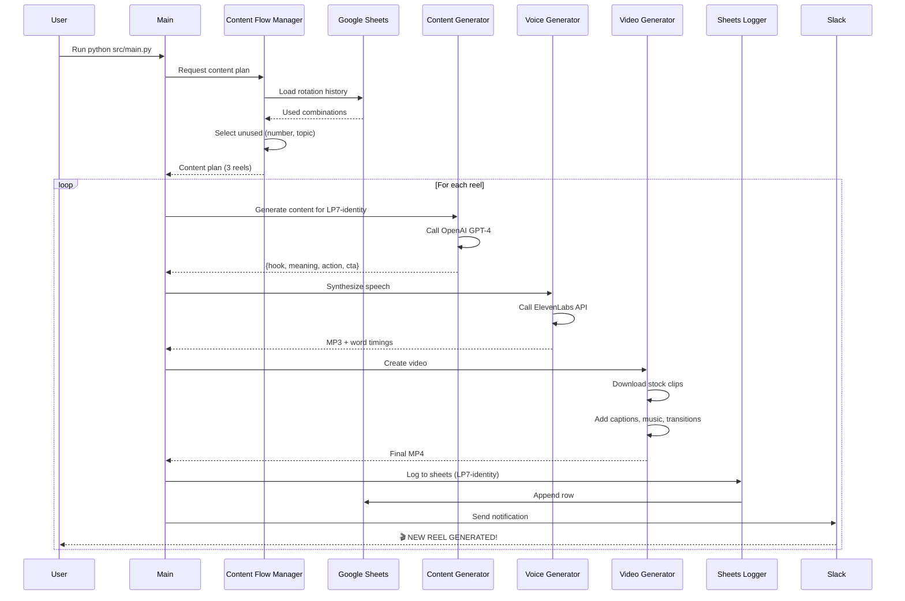

# The17Project - Automated Reel Generator

Professional Instagram reel generator for Life Path Numbers and Angel Numbers content with AI-powered content, voice synthesis, and automated video creation.

---

## 📋 Table of Contents

- [Overview](#overview)
- [Architecture](#architecture)
- [Key Features](#key-features)
- [Content Flow](#content-flow)
- [Quick Start](#quick-start)
- [Configuration](#configuration)
- [Usage](#usage)
- [Components](#components)
- [Rotation System](#rotation-system)

---

## 🎯 Overview

The17Project automates the creation of professional Instagram reels combining:
- **Life Path Numbers**: Numerology-based personality insights (Mon/Wed/Fri)
- **Angel Numbers**: Spiritual number meanings (Tue/Thu/Sat)
- **Wildcard Mix**: Combination of both (Sunday)

Each reel includes AI-generated content, natural voice synthesis, synced captions, professional transitions, and background music.

---

## 🏗️ Architecture



---

## ✨ Key Features

### Content Generation
- **AI-Powered Scripts**: OpenAI GPT-4 generates unique, engaging content
- **Natural Voice**: ElevenLabs text-to-speech with professional voice quality
- **Smart Rotation**: No repeats until all (number, topic/style) combinations are used

### Video Production
- **Professional Quality**: 1080x1920 Instagram-ready format
- **Synced Captions**: Word-level timing with alternating colors
- **Stock Footage**: Auto-sourced from Pexels/Pixabay
- **Background Music**: Royalty-free tracks at optimal volume
- **Color Rotation**: 6 text colors rotate for visual variety

### Automation
- **GitHub Actions**: Scheduled generation at 6am, 12pm, 6pm EST
- **Google Sheets Logging**: Automatic tracking of all generated content
- **Slack Notifications**: Instant alerts with ready-to-copy captions
- **Test Mode**: Generate reels locally without affecting rotation

### Instagram Integration
- **Custom Captions**: Hashtag rotation (30+ tags per type)
- **CTA Footer**: seventhlifepath.com link + engagement prompts
- **Content-Specific Tags**: Auto-includes #lifepath7, #angelnumber888, etc.

---

## 🔄 Content Flow



---

## 🚀 Quick Start

### Prerequisites
```bash
# Python 3.9+
python3 --version

# Install dependencies
pip install -r requirements.txt

# Required: ffmpeg for video processing
brew install ffmpeg  # macOS
# or
apt-get install ffmpeg  # Linux
```

### Environment Setup
Create `.env` file:
```bash
# AI Services
OPENAI_API_KEY=sk-...
ELEVENLABS_API_KEY=...
ELEVENLABS_VOICE_ID=...

# Google Sheets (for rotation tracking)
GOOGLE_SHEETS_CREDENTIALS=path/to/credentials.json
GOOGLE_SHEET_ID=your-sheet-id

# Slack Notifications (optional)
SLACK_BOT_TOKEN=xoxb-...
SLACK_CHANNEL_ID=C...
```

---

## 🎮 Usage

### Production Mode (Affects Rotation)
```bash
# Generate 1 reel (based on GENERATE_FULL_DAY flag in main.py)
python src/main.py

# Generate specific reel for scheduled runs
python src/main.py --reel-number 1  # Reel 1 of 3
python src/main.py --reel-number 2  # Reel 2 of 3
python src/main.py --reel-number 3  # Reel 3 of 3
```

### Test Mode (Doesn't Affect Rotation)
```bash
# Generate test reel - logs as "TEST" in sheets
python src/main.py --test

# Test specific reel number
python src/main.py --test --reel-number 1
```

**Test Mode Features:**
- ✅ Generates real reels with all features
- ✅ Sends Slack notification with 🧪 TEST header
- ✅ Logs to Google Sheets with "TEST" identifier
- ✅ Ignored by rotation tracking (won't consume combinations)
- ✅ Perfect for local testing and experimentation

### Scheduled Automation (GitHub Actions)
```yaml
# .github/workflows/generate_reels.yml
# Runs 3 times daily: 6am, 12pm, 6pm EST
- Reel 1: 6:00 AM
- Reel 2: 12:00 PM
- Reel 3: 6:00 PM
```

---

## 📦 Components

### Core Modules

| Module | Purpose |
|--------|---------|
| `main.py` | Entry point, orchestrates entire pipeline |
| `content_flow_manager.py` | Scheduling, rotation logic, caption generation |
| `life_path_generator.py` | Generate Life Path content via OpenAI |
| `content_generator.py` | Generate Angel Number content via OpenAI |
| `voice_generator.py` | Text-to-speech via ElevenLabs |
| `video_generator.py` | Video compilation, captions, music, transitions |
| `sheets_logger.py` | Google Sheets integration for tracking |
| `slack_notifier.py` | Slack notifications with captions |

### Data Files

| File | Purpose |
|------|---------|
| `life_paths_db.py` | 9 Life Path definitions with traits |
| `angel_numbers_db.py` | Angel Number database (111, 222, 333, etc.) |
| `content_flow_manager.py` | Hashtag pools (30 tags each type) |

---

## 🔄 Rotation System

### How It Works

The rotation system ensures **no repetition** until all combinations are exhausted:

#### Life Path Rotation
- **Combinations**: (Life Path Number 1-9) × (6 Angles)
- **Total**: 54 unique combinations
- **Example**: LP7-Identity won't repeat until all LP7 angles are used
- **Tracking**: `LP7-identity` stored in Google Sheets Column B

#### Angel Number Rotation
- **Combinations**: (Angel Number) × (3 Styles)
- **Total**: ~150+ unique combinations
- **Example**: 888-Storytelling won't repeat until all 888 styles are used
- **Tracking**: `888` + `storytelling` stored in Sheets

#### Color Rotation
- **6 Colors**: Yellow, Pink, Purple, Coral, Orange, Sky Blue
- **Cycles**: Colors rotate randomly without repeats until all 6 used

#### Hashtag Rotation
- **30 Tags per Type**: Life Path (30), Angel Number (30)
- **Selection**: Random 12-15 tags per post
- **Content-Specific**: Auto-adds #lifepath7, #angelnumber888, etc.

### Rotation Tracking

```python
# Google Sheets Structure:
# Column A: Timestamp
# Column B: Identifier (e.g., "LP7-identity" or "888")
# Column C: Type/Style (e.g., "life_path" or "storytelling")

# Rotation logic skips entries marked "TEST"
if row[1] != 'TEST':
    used_combinations.add((number, angle))
```

---

## 📊 Content Schedule

| Day | Content Type | Reels/Day |
|-----|--------------|-----------|
| Monday | Life Path Numbers | 3 |
| Tuesday | Angel Numbers | 3 |
| Wednesday | Life Path Numbers | 3 |
| Thursday | Angel Numbers | 3 |
| Friday | Life Path Numbers | 3 |
| Saturday | Angel Numbers | 3 |
| Sunday | Wildcard Mix (2 LP + 1 AN) | 3 |

**Total**: 21 reels/week

---

## 🎨 Visual Features

### Text Color Palette
```python
YELLOW:   RGB(255, 200, 0)   # Original brand color
PINK:     RGB(255, 100, 150) # Hot pink
PURPLE:   RGB(150, 100, 255) # Purple
CORAL:    RGB(255, 80, 80)   # Red/Coral
ORANGE:   RGB(255, 150, 50)  # Orange
SKYBLUE:  RGB(100, 200, 255) # Sky blue
```

### Video Specs
- **Resolution**: 1080x1920 (9:16 Instagram Reel)
- **Duration**: ~20-25 seconds (voice + 2s end card)
- **Format**: MP4 (H.264)
- **Captions**: White + Accent color alternating lines
- **Music**: Royalty-free, 15% volume mix

---

## 📝 Caption Format

### Life Path Example
```
Life Path 7: The Seeker

Your mind craves depth—mysteries, patterns, truth.

You see what others miss. That's your power.

Own your need for solitude. It's where clarity lives.

👇 What's YOUR Life Path Number?

Calculate: seventhlifepath.com
Comment your number below!

New here? Watch my intro (pinned post) 📍

#lifepath7 #numerology #lifepath #spirituality...
```

### Angel Number Example
```
Seeing 888?

Abundance is aligning for you right now.

The universe rewards your effort. Stay focused.

Take the next step toward your financial goals.

👇 What's YOUR Life Path Number?

Calculate: seventhlifepath.com
Comment your number below!

New here? Watch my intro (pinned post) 📍

#angelnumber888 #numerology #angelnumbers...
```

---

## 🔧 Configuration

### Settings in `main.py`

```python
# Generate full day (3 reels) or single test reel
GENERATE_FULL_DAY = False  # Set True for manual batch generation

# Force specific day type for testing
FORCE_DAY_TYPE = None  # Options: 'life_path', 'angel_number', 'wildcard'
```

### Output Location
```python
# Automatic detection:
/mnt/user-data/outputs  # If exists (server)
/output                 # Otherwise (local)
```

---

## 📈 Monitoring

### Google Sheets Columns
- **A**: Timestamp (when generated)
- **B**: Identifier (LP7-identity or 888)
- **C**: Type (life_path, angel_number)
- **D**: Full transcript
- **E**: Instagram caption
- **F**: Video path
- **G**: Duration
- **H**: Video sources

### Slack Notifications
- **Header**: 🎬 NEW REEL GENERATED! (or 🧪 TEST REEL GENERATED!)
- **Content ID**: LP7-identity or 888
- **Type**: Life Path or Angel Number
- **Duration**: Video length
- **Caption**: Full Instagram-ready caption
- **Video**: Compressed file attachment

---

## 🛠️ Troubleshooting

### Common Issues

**Missing API Keys**
```bash
# Check .env file exists and has all required keys
cat .env | grep API_KEY
```

**Google Sheets Error**
```bash
# Verify credentials.json exists and GOOGLE_SHEET_ID is correct
# Sheet must have header row: Timestamp | Number | Style | ...
```

**Video Generation Fails**
```bash
# Check ffmpeg is installed
ffmpeg -version

# Check output directory permissions
ls -la output/
```

**Voice Generation Slow**
```bash
# ElevenLabs API rate limits apply
# Test mode doesn't bypass API calls
```

---

## 📁 Project Structure

```
The17Project/
├── src/
│   ├── main.py                      # Entry point
│   ├── content_flow_manager.py      # Scheduling & rotation
│   ├── life_path_generator.py       # LP content generation
│   ├── content_generator.py         # AN content generation
│   ├── voice_generator.py           # ElevenLabs TTS
│   ├── video_generator.py           # Video compilation
│   ├── sheets_logger.py             # Google Sheets logging
│   ├── slack_notifier.py            # Slack notifications
│   ├── life_paths_db.py             # Life Path data
│   └── angel_numbers_db.py          # Angel Number data
├── output/                          # Generated videos (local)
├── .github/workflows/               # GitHub Actions
├── .env                             # API keys (not committed)
├── requirements.txt                 # Python dependencies
└── README.md                        # This file
```

---

## 🎯 Best Practices

### Local Testing
1. Always use `--test` flag for local development
2. Test mode doesn't affect production rotation
3. Review Slack TEST notifications to verify output

### Production Runs
1. Let GitHub Actions handle scheduled generation
2. Manual runs consume rotation combinations
3. Check Google Sheets after each run to verify tracking

### Debugging
1. Check console output for detailed logs
2. Review Google Sheets for rotation state
3. Test individual components (voice, video) separately

---

## 📊 Performance Metrics

| Metric | Value |
|--------|-------|
| Generation Time | ~60-90 seconds/reel |
| Content Quality | GPT-4 powered |
| Voice Quality | ElevenLabs professional |
| Video Resolution | 1080x1920 (Full HD) |
| Automation Level | 100% hands-free |
| Daily Output | 3 reels/day (21/week) |

---

## 🔮 Future Enhancements

- [ ] Color rotation tracking in Google Sheets
- [ ] Custom voice selection per content type
- [ ] Advanced video effects and transitions
- [ ] Multi-language support
- [ ] Analytics dashboard integration
- [ ] A/B testing for caption formats

---

## 📄 License

Proprietary - The17Project

---

## 🤝 Support

For issues or questions:
1. Check troubleshooting section above
2. Review Google Sheets logs for rotation state
3. Test with `--test` flag to isolate issues

---

**Built with ❤️ for The17Project**
